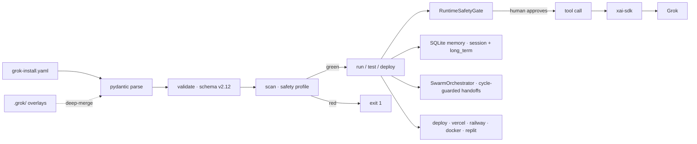

<!-- NEON / CYBERPUNK REPO TEMPLATE · GROK-INSTALL-CLI -->

<p align="center">
  
</p>

<h1 align="center">⚡ grok-install</h1>

<p align="center">
  <b>The <code>npm install</code> for Grok agents.</b><br/>
  Declare your agent in a single <code>grok-install.yaml</code> — then install, run, and deploy it with one command.
</p>

<p align="center">
  
</p>

<p align="center">
  <a href="https://github.com/agentmindcloud/grok-install-cli/actions/workflows/ci.yml"></a>
  <a href="https://www.python.org/"></a>
  <a href="https://github.com/xai-org/xai-sdk-python"></a>
  
  <a href="./LICENSE"></a>
  <a href="https://github.com/agentmindcloud/grok-install-cli"></a>
</p>

---

## ✦ 60-Second Install

> **Note:** the PyPI package is published on every `v*.*.*` tag. If
> `pip install grok-install` can't find the package yet, install directly from
> source: `pip install 'git+https://github.com/agentmindcloud/grok-install-cli'`.

```bash
pip install grok-install
export XAI_API_KEY=...
grok-install init my-agent
grok-install run my-agent
```

That's it. **Three commands from nothing to a live Grok agent** answering prompts at your terminal.

## ✦ Why This Exists

<table>
  <tr>
    <td width="33%">
      <h3>⚡ 12 Lines, Not 80</h3>
      <p>Hand-rolled <code>xai-sdk</code> for a working agent: ~80 lines of Python. With <code>grok-install</code>: 12 lines of YAML.</p>
    </td>
    <td width="33%">
      <h3>🛡️ Safety by Default</h3>
      <p>Pre-install scan blocks hardcoded keys, missing rate limits, approval-less X posting. Runtime gate blocks every tool call on a prompt.</p>
    </td>
    <td width="33%">
      <h3>🔌 Wraps, Never Replaces</h3>
      <p>Uses the official <code>xai-sdk</code> underneath. Upgrade it on your own cadence without touching your agent config.</p>
    </td>
  </tr>
</table>

## ✦ Your Agent Is a YAML File

```yaml
# grok-install.yaml
spec_version: "2.12"
name: hello-agent
llm:
  model: grok-2-latest
  api_key_env: XAI_API_KEY
runtime:
  type: cli
safety:
  safety_profile: balanced
agents:
  default:
    description: A friendly agent that can read files and search the web.
    tools:
      - read_file
      - web_search
```

The CLI handles the rest — boilerplate, tool wiring, approval gates, deploy config, memory, swarm orchestration.

## ✦ How It Works



## ✦ Commands

| Command | What it does |
|---|---|
| `grok-install init [path] --name <slug>` | Scaffold a new agent project. |
| `grok-install validate [path] [--json]` | Validate YAML against the spec. |
| `grok-install scan [path] [--json]` | Pre-install safety scan (green / yellow / red). |
| `grok-install run [path] [-p PROMPT] [--agent NAME] [--dry-run]` | Run the agent locally against Grok. |
| `grok-install test [path]` | Dry-run with mock tools (no network). |
| `grok-install deploy [path] --target vercel\|railway\|docker\|replit [--force]` | Generate deploy config. |
| `grok-install install <github-url> [--dest DIR] [--run]` | Clone + scan + optionally run a remote agent repo. |
| `grok-install publish [path]` | Print awesome-grok-agents JSON metadata on stdout. |
| `grok-install --version` | Print the installed version. |

**Machine-parseable output:** pass `--json` to `validate` or `scan` for schema-stable reports on stdout. Exit codes: `0` ok · `1` validation/scan failed · `2` parse error. Payloads carry a `schema_version` discriminator so downstream tools can pin.

## ✦ Deploy Targets

<p align="center">
  
  
  
  
</p>

```bash
grok-install deploy --target vercel     # serverless
grok-install deploy --target railway    # long-running
grok-install deploy --target docker     # container
grok-install deploy --target replit     # dev/prototype
```

## ✦ Project Layout

`grok-install` recognises any of these filenames as the primary config:

- `grok-install.yaml` / `grok-install.yml`
- `grok-swarm.yaml` / `grok-swarm.yml`
- `grok-voice.yaml` / `grok-voice.yml`

A sibling `.grok/` directory of `*.yaml` / `*.yml` overlays is **deep-merged** into the primary config (last-write wins per top-level key) — handy for environment-specific tweaks without forking the main file.

### Top-level blocks on the install spec

<p align="center">
  
  
  
  
  
  
</p>
<p align="center">
  
  
  
  
  
</p>

Runtime `type` is one of `cli`, `x-bot`, `webhook`, `scheduled` (requires a cron `schedule`), or `http`.

## ✦ Multi-Agent Swarm

Set `intelligence.multi_agent_swarm: true` and declare each agent's `handoff:` list.

At runtime, `SwarmOrchestrator` drives the hops with a **cycle guard**, and any agent can transfer control by calling the built-in `handoff_to` tool.

```yaml
intelligence:
  multi_agent_swarm: true
agents:
  researcher:
    handoff: [critic]
  critic:
    handoff: [publisher]
  publisher:
    handoff: []
```

## ✦ Works with the Official xAI SDK

Install the SDK extra when you need real model calls:

```bash
pip install 'grok-install[xai]'
```

`grok-install` **never re-implements the SDK** — it wraps it. Upgrade `xai-sdk` on your own cadence without touching your agent config.

## ✦ Safety by Default

<table>
  <tr>
    <td width="50%">
      <h3>🔎 Pre-Install Scan</h3>
      <p>Fails loudly on hard-coded API keys in YAML, writing tools without a rate limit, missing <code>require_human_approval</code> on <code>post_thread</code> / <code>reply_to_mention</code> / <code>post_image</code> / <code>create_pr</code> / <code>comment_on_issue</code> / <code>run_command</code>.</p>
    </td>
    <td width="50%">
      <h3>🛑 Runtime Safety Gate</h3>
      <p>Every tool call passes through <code>RuntimeSafetyGate</code>, which blocks on a CLI prompt until the user approves. <b>There is no "skip the gate" flag.</b></p>
    </td>
  </tr>
  <tr>
    <td>
      <h3>⛔ Hard-Block Tool List</h3>
      <p>Reference to <code>mass_dm</code>, <code>bypass_rate_limit</code>, <code>image_gen_real_people</code>, and other blocked patterns triggers an immediate red scan.</p>
    </td>
    <td>
      <h3>📋 Full Threat Model</h3>
      <p>See <a href="./SECURITY.md">SECURITY.md</a> for the complete threat model and disclosure policy.</p>
    </td>
  </tr>
</table>

## ✦ Manual SDK vs grok-install

| | `xai-sdk` by hand | `grok-install` |
|---|---|---|
| Lines to get running | ~80 | **12 (YAML)** |
| Built-in safety gate | ✗ | ✓ |
| Tool registry | ✗ | **17 built-ins** |
| Multi-agent swarm | DIY | `multi_agent_swarm: true` |
| Memory | DIY | SQLite, session + long_term |
| Deploy configs | DIY | `--target vercel\|railway\|docker\|replit` |

## ✦ Examples

<table>
  <tr>
    <td width="50%">
      <h3>👋 hello-agent</h3>
      <p>A minimal working agent. Grok + <code>read_file</code> + <code>web_search</code>, no approval gates. Perfect starting point.</p>
      <a href="./examples/hello-agent">examples/hello-agent →</a>
    </td>
    <td width="50%">
      <h3>💬 reply-bot</h3>
      <p>An X mention-reply bot with a human-in-the-loop approval gate on every post.</p>
      <a href="./examples/reply-bot">examples/reply-bot →</a>
    </td>
  </tr>
</table>

## ✦ Spec

`grok-install` implements **grok-install.yaml v2.12**. See the top-level `GrokInstallConfig` Pydantic model ([`src/grok_install/core/models.py`](./src/grok_install/core/models.py)) for the authoritative schema.

## ✦ Sibling Repos

<table>
  <tr>
    <td width="33%">
      <h3>📦 grok-install (spec)</h3>
      <p>The universal YAML spec this CLI implements.</p>
      <a href="https://github.com/agentmindcloud/grok-install">Repository →</a>
    </td>
    <td width="33%">
      <h3>🌟 awesome-grok-agents</h3>
      <p>10 certified templates you can install with <code>grok-install install</code>.</p>
      <a href="https://github.com/agentmindcloud/awesome-grok-agents">Repository →</a>
    </td>
    <td width="33%">
      <h3>🤖 grok-install-action</h3>
      <p>GitHub Action that wraps this CLI for PR validation.</p>
      <a href="https://github.com/agentmindcloud/grok-install-action">Repository →</a>
    </td>
  </tr>
  <tr>
    <td>
      <h3>📐 grok-yaml-standards</h3>
      <p>12 modular YAML extensions beyond the core spec.</p>
      <a href="https://github.com/agentmindcloud/grok-yaml-standards">Repository →</a>
    </td>
    <td>
      <h3>🛒 grok-agents-marketplace</h3>
      <p>The live marketplace at <a href="https://grokagents.dev">grokagents.dev</a>.</p>
      <a href="https://github.com/agentmindcloud/grok-agents-marketplace">Repository →</a>
    </td>
    <td>
      <h3>🎭 grok-agent-orchestra</h3>
      <p>Multi-agent runtime with mandatory safety veto.</p>
      <a href="https://github.com/agentmindcloud/grok-agent-orchestra">Repository →</a>
    </td>
  </tr>
</table>

## ✦ Connect

<p align="center">
  <a href="https://github.com/agentmindcloud">
    
  </a>
  <a href="https://x.com/JanSol0s">
    
  </a>
  <a href="https://grokagents.dev">
    
  </a>
</p>

## ✦ License

Apache 2.0 — see [LICENSE](./LICENSE).

<p align="center">
  
</p>
